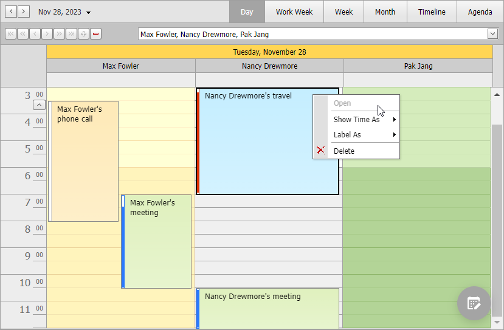

<!-- default badges list -->

<!-- default badges end -->
# Scheduler for ASP.NET Web Forms - How to modify availability and visibility of context menu items on the client side

This example demonstrates how to change availability and visibility of [ASPxScheduler](https://docs.devexpress.com/AspNet/3685/components/scheduler) control's context menu items based on the selected appointment.

The Scheduler control's server-side [PopupMenuShowing](https://docs.devexpress.com/AspNet/DevExpress.Web.ASPxScheduler.ASPxScheduler.PopupMenuShowing) event allows you to access and customize the context menu. Handle the menu's client-side [PopUp](https://docs.devexpress.com/AspNet/DevExpress.Web.MenuClientSideEvents.PopUp) event to modify menu item settings based on the selected appointment. In this example, the [PopUp](https://docs.devexpress.com/AspNet/DevExpress.Web.MenuClientSideEvents.PopUp) event's handler performs the following actions:

* Enables or disables the **Open** item based on the selected appointment's status and subject.
* Shows or hides the **Delete** item based on the selected appointment's status.

## Files to Review

* [CustomDataSource.cs](./CS/WebSite/CustomDataSource.cs) (VB: [CustomDataSource.vb](./VB/WebSite/CustomDataSource.vb))
* [CustomObjects.cs](./CS/WebSite/CustomObjects.cs) (VB: [CustomObjects.vb](./VB/WebSite/CustomObjects.vb))
* [Default.aspx](./CS/WebSite/Default.aspx) (VB: [Default.aspx](./VB/WebSite/Default.aspx))
* [Default.aspx.cs](./CS/WebSite/Default.aspx.cs) (VB: [Default.aspx.vb](./VB/WebSite/Default.aspx.vb))

## Documentation

- [Scheduler Examples](https://docs.devexpress.com/AspNet/3800/components/scheduler/examples)

## More Examples

- [How to create a custom adaptive appointment form using templates (User Control)](https://github.com/DevExpress-Examples/asp-net-web-forms-scheduler-custom-adaptive-form-using-templates)
- [How to bind a scheduler to a MS SQL Server database](https://github.com/DevExpress-Examples/asp-net-web-forms-scheduler-bind-to-sql)
